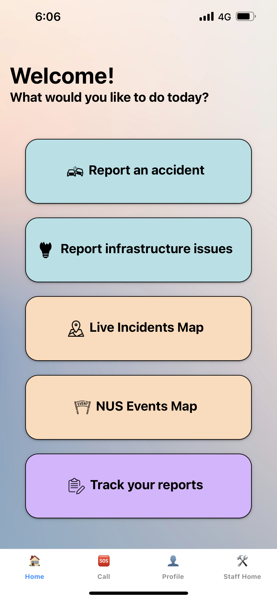
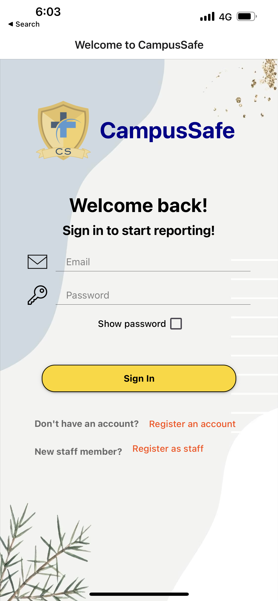

# CampusSafe - Your one-stop incident reporting app

  
  
  

## About the project
CampusSafe is a mobile application that allows users to report incidents on campus. The app is designed to be used by students, faculty, and staff of NUS. The app allows users to report incidents such as motor incidents, fire, and infrastructural issues around the campus. We aim to enhance the safety and security for NUS students and staff while also enabling the school to quickly and efficiently maintain school infrastructure. CampusSafe has attained an Apollo11 achievement for Orbital 2023.

- Main collaborators are [Nicholas](https://github.com/nicleongyj) and [Cheng Yee](https://github.com/cheng-yee).
- You can view our full project README [here](https://docs.google.com/document/d/1tUBVeQTsiAxRkrrEykURVC_DtlgU7eh4MFMpi0x-q9Q/edit?usp=sharing).

## Built With
- React Native
- React Native Maps
- Supabase
- Expo

## Features
- 📝 Report incidents and infrastructural issues on campus.
- 🗺️ View verified incidents on a live interatice map.
- 📊 Track your reports and view your report history.

## User Stories
Students or Normal Users:
1. As a student, I want to be able to create an account and securely login, so that I can access the reporting features.
2. As a student, I want to be able to fill up a form to report an incident, so that other students will be notified of this incident.
3. As a student, I want to be able to view incidents and infrastructure issues on a campus map, so that I can visualize where exactly the incident took place.
4. As a student, I want to be able to track my current and past incident and infrastructure reports separately, so that I can easily access and track the status of my reports.
5. As a student, I want to receive real-time notifications about accidents occurring on campus, allowing me to avoid those locations and ensure my safety.

Staff members:
1. As a school staff member, I want to have a special account type that gives me necessary privileges to approve, reject and resolve reported incidents.
2. As a school staff member, I want to have access to a dashboard so that I can easily view and manage reported incidents.
3. As a school staff member, I want to have the ability to mark a reported incident as verified or rejected based on my assessment of the situation, so that other users of the app can view it on the map.
4. As a school staff member, I want to have the ability to mark a verified incident as resolved whenever the incident is resolved, so that it does not give students the impression that there is still an accident happening.
5. As a school staff member, I want to be able to view the details of a reported incident in order to assess the validity of the incident.

## Poster
  

    
  

